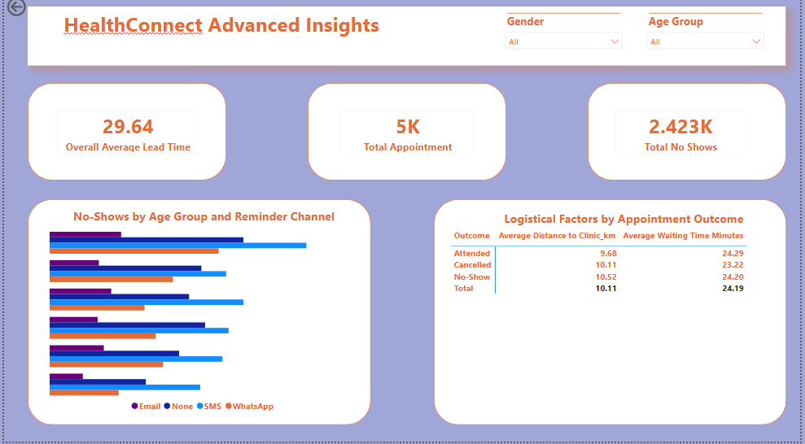

## Week 6: Advanced Analytics & Cross-Track Integration

Building on the initial exploratory data analysis, Week 6 focused on advanced multivariate analysis to identify specific demographic intersections contributing to the ~48.5% no-show rate. 

### Key Analytical Insights
* **Demographic Vulnerabilities:** A multivariate analysis of age groups versus reminder channels revealed that the lack of reminders ("None") is a primary driver of missed appointments across all age brackets. 
* **Logistical Validation:** Analyzed average wait times and clinic distances, proving these are not primary drivers of no-shows. Attending patients traveled an average of 9.68 km and waited 24.29 minutes, while no-show patients had nearly identical baselines (10.52 km and 24.20 minutes).

### Cross-Functional Collaboration
As part of a simulated multidisciplinary project, I executed a data handoff to the Data Science track. I provided a formal feature-recommendation memo advising that `booking_lead_days`, `reminder_channel`, and `age_group` be heavily weighted in their baseline classification model based on the validated EDA.

### Week 6 Files Added:
* `HealthConnect_Initial_Dashboard_Abdullahi.pbix` (Updated with Advanced Insights Page)
* `Week6_Advanced_Analytics_Report_Abdullahi.pdf`
* `Week6_Cross_Track_Integration_Memo.pdf`
* `Week6_Project_Summary_Abdullahi_Ahmad.pdf`
